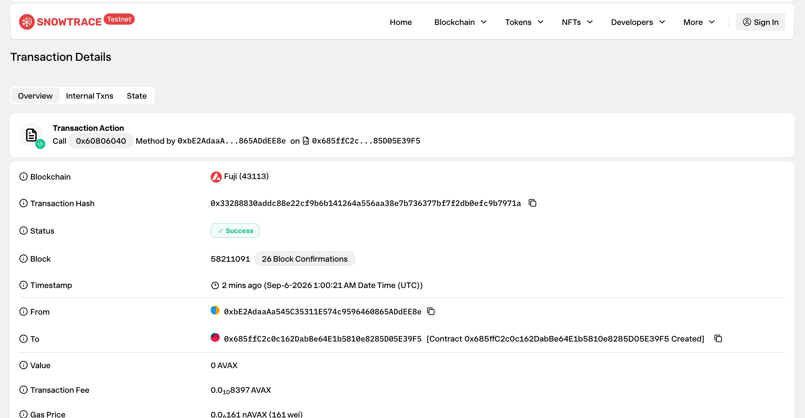

# Task 2：Vibe Coding开发你的第一个DApp

> 对应课程：第二章  
> 截止提交：<9月6日> 24:00:00 (UTC+8)  
> 学员：monstersquad227

## 任务目标

用 Vibe Coding + Hardhat（Scaffold-ETH 同栈）在 Avalanche Fuji 测试网部署简单存取款合约。

## 参考资料
Scaffold-ETH 项目开发模板
https://scaffoldeth.io/
https://github.com/scaffold-eth/scaffold-eth-2

领取 Avalanche Fuji 测试网 token
https://build.avax.network/console/primary-network/faucet

## 任务要求
把合约成功部署至Avalanche 测试网

## 提交方式

###  部署结果

| 项目 | 内容 |
| --- | --- |
| 网络 | Avalanche Fuji C-Chain (43113) |
| 合约地址 | 0x685ffC2c0c162DabBe64E1b5810e8285D05E39F5 |
| 部署交易 | [0x33288830addc88e22cf9b6b141264a556aa38e7b736377bf7f2db0efc9b7971a](https://testnet.snowtrace.io/tx/0x33288830addc88e22cf9b6b141264a556aa38e7b736377bf7f2db0efc9b7971a) |
| Explorer | https://testnet.snowtrace.io/address/0x685ffC2c0c162DabBe64E1b5810e8285D05E39F5 |

### 截图

部署成功截图：

## 截止时间

<9月6日> 24:00:00 (UTC+8)。截止后提交的作业没有奖励。
